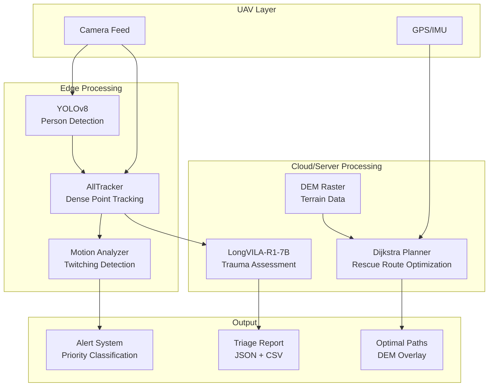
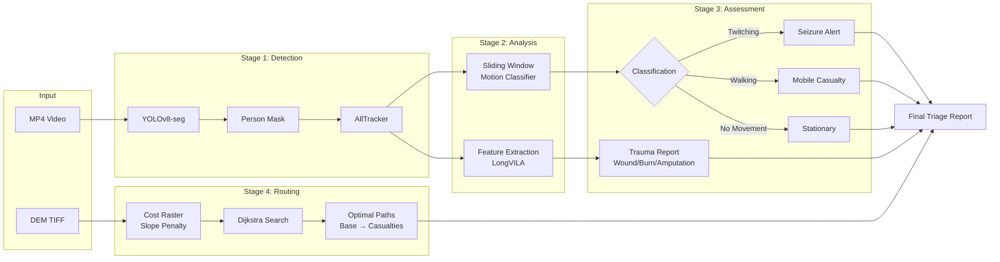
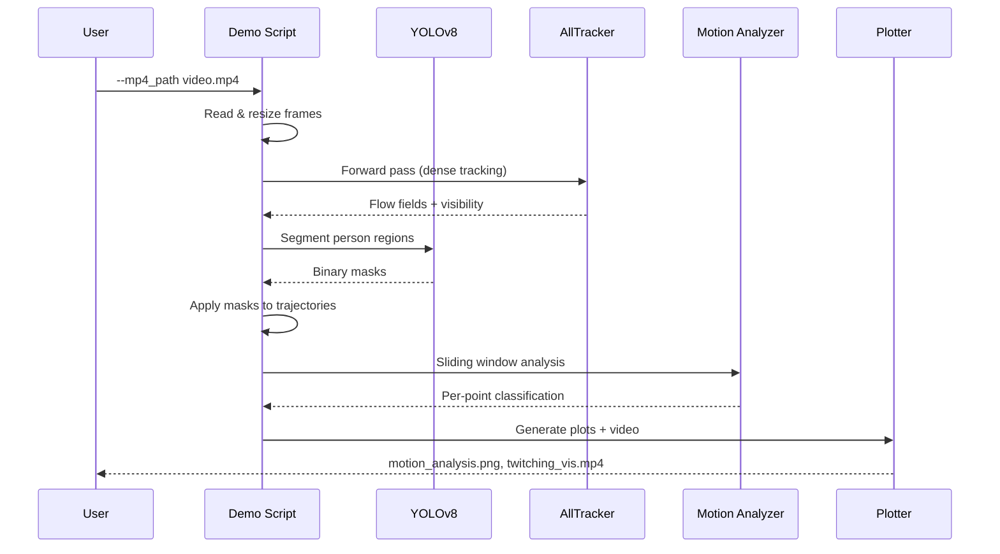
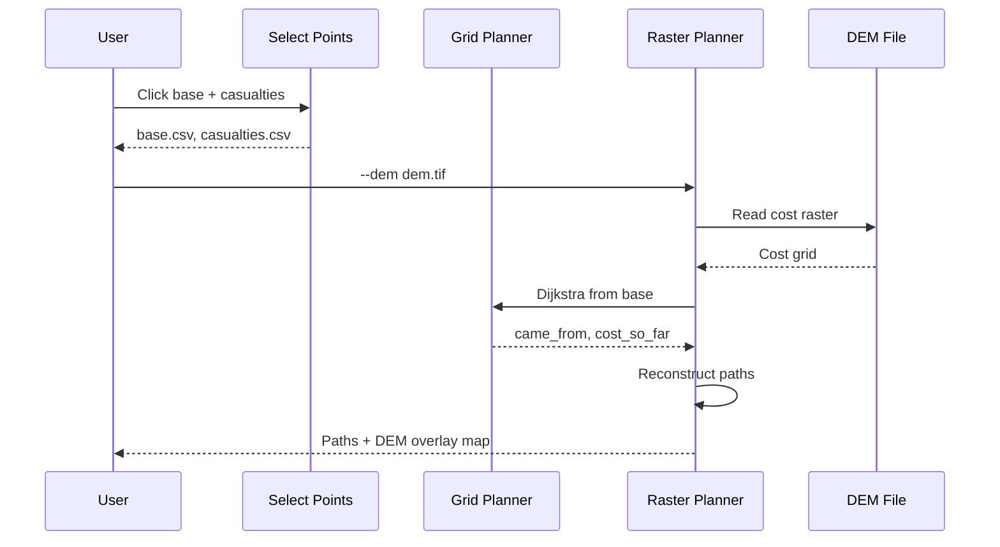
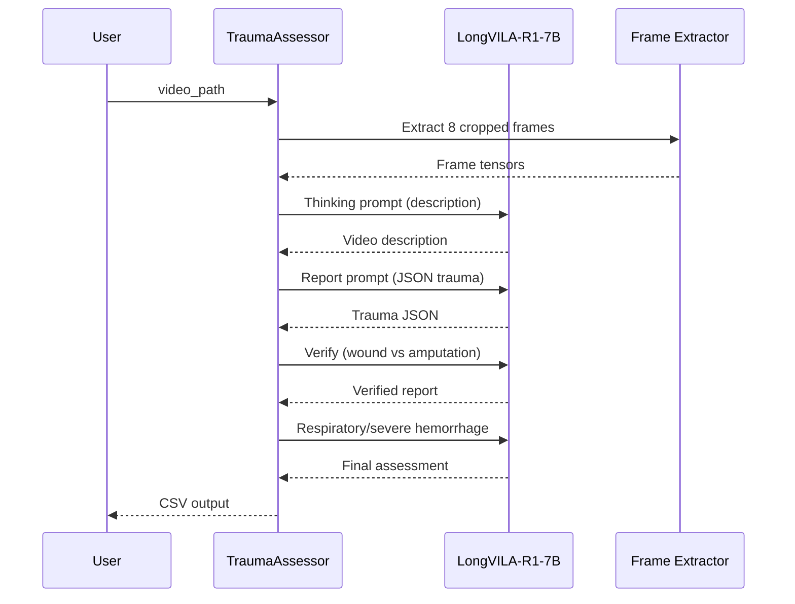
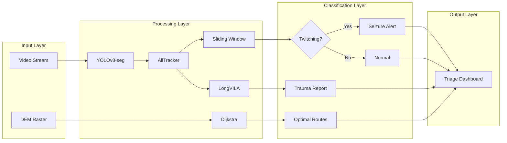

<div align="center">

# 🛰️ UAV Triage System

### Autonomous Multi-Modal Casualty Triage via Unmanned Aerial Vehicles

[](https://www.python.org/)
[](https://pytorch.org/)
[](https://developer.nvidia.com/cuda-toolkit)
[](https://opensource.org/licenses/MIT)
[](https://www.docker.com/)
[](#)

</div>

---

## The Problem

Disaster zones are chaotic. After earthquakes, floods, or armed conflicts, casualties are scattered across terrain that is often **inaccessible by ground vehicles** — collapsed bridges, flooded roads, landslides, or active combat zones. The golden hour for trauma treatment is critical: every minute of delay increases mortality by approximately 7%.

Traditional triage requires **human medics on the ground** to physically reach each casualty, assess their condition, and manually coordinate evacuation routes. This is slow, dangerous, and doesn't scale when hundreds of casualties are spread across a large area.

**What if a fleet of UAVs could do the first mile of triage autonomously?**

## The Idea

UAV Triage System is an end-to-end autonomous pipeline that takes a fleet of camera-equipped drones and turns them into **force multipliers for disaster response**. The system handles the full loop — from the moment a UAV spots a casualty to generating an actionable triage report and optimal rescue routes:

1. **See** — YOLOv8-segmentation detects and isolates human figures from the UAV's live video feed, filtering out debris, vehicles, and terrain noise.

2. **Track** — AllTracker (ICCV 2025) runs dense point tracking on every detected person, computing per-pixel motion trajectories across the entire video sequence. Unlike simple bounding-box trackers, this captures the **fine-grained kinematics** of each casualty's body.

3. **Classify Motion** — A sliding-window directness ratio classifier analyzes each tracked point's trajectory to distinguish between:
   - **Walking** (smooth, purposeful movement — mobile casualty)
   - **Twitching** (high-frequency, non-directional oscillation — seizure, neurogenic shock, or agonal breathing)
   - **No Movement** (stationary — unconscious or deceased)
   - **General Movement** (spinning, erratic — disoriented)

4. **Assess Trauma** — For each casualty, cropped video frames are fed into LongVILA-R1-7B, a vision-language model that generates structured JSON trauma reports classifying wounds, amputations, burns, fractures, and respiratory/hemorrhage status across 8 body regions.

5. **Route Rescue** — A Dijkstra-based path planner computes terrain-optimal routes from the NDRF base to each casualty location on a Digital Elevation Model, penalizing steep slopes and rough terrain to find the **smoothest, fastest path** for ground teams.

The output is a single **triage dashboard** that prioritizes casualties by severity, provides AI-generated trauma assessments, and hands rescue teams GPS-guided optimal routes — all without a single human stepping into the danger zone.

## Why This Matters

- **Speed**: Triage reports generated in seconds, not minutes per casualty
- **Scale**: One operator can deploy a fleet covering an area that would need dozens of ground teams
- **Safety**: Assessment happens remotely — no medic exposure to collapsed structures, flooding, or hostile environments
- **Accuracy**: VLM-based assessment provides consistent, structured reports free from human fatigue or stress-induced errors
- **Actionable Output**: Not just classification — the system outputs routes that rescue teams can follow immediately

---

## 🎬 Project Pitch

<div align="center">
  <a href="https://youtu.be/E7XxPrKFcic?si=nFSgzKHWvBkNNUuz">
    
  </a>
  <br>
  <em>TEAM M3OW — UAV Triage System | Robotics &amp; Drones</em>
</div>

<details>
<summary>Watch on YouTube</summary>

[](https://youtu.be/E7XxPrKFcic?si=nFSgzKHWvBkNNUuz)

</details>

---

## Demo Run

<div align="center">
  <a href="https://www.youtube.com/watch?v=lw-OaKTZjio&list=PL6I2U3jEFWEUMN6iADnyaCkueP5Ci3630&index=2">
    
  </a>
  <br>
  <em>PS25134 - SanjeevniUAV Demo Run</em>
</div>

<details>
<summary>Watch on YouTube</summary>

[](https://www.youtube.com/watch?v=lw-OaKTZjio&list=PL6I2U3jEFWEUMN6iADnyaCkueP5Ci3630&index=2)

</details>

---

## System Architecture



---

## Data Flow



---

## Subsystem Pipelines

### 1. Twitching Detection Pipeline



### 2. DEM Pathfinding Pipeline



### 3. Trauma Assessment Pipeline



---

## Project Structure

```
UAV-Triage-System/
├── src/
│   ├── pathfinding/              # DEM-based Dijkstra path planning
│   │   ├── grid_planner.py       #   Core Dijkstra on cost grids
│   │   ├── raster_planner.py     #   Raster I/O + path reconstruction
│   │   └── select_points.py      #   Interactive point selection GUI
│   ├── trauma/                   # Video trauma assessment
│   │   └── trauma_assessor.py    #   LongVILA multi-stage report gen
│   ├── detection/                # Point tracking + motion analysis
│   │   ├── demo.py               #   Single video inference
│   │   ├── demo_batch.py         #   Batch folder inference
│   │   ├── batch_demo_yolo.py    #   YOLO-masked batch inference
│   │   ├── sliding_window.py     #   Sliding window motion classifier
│   │   ├── motion_analyzer.py    #   Global motion metrics
│   │   ├── yolo_segmenter.py     #   YOLOv8 person segmentation
│   │   ├── yolo_detector.py      #   YOLOv8 person bbox cropping
│   │   ├── rep_ratio.py          #   Repetition ratio computation
│   │   ├── path_analysis.py      #   Normalized path analysis
│   │   ├── vel_acc.py            #   Velocity/acceleration plots
│   │   ├── plot_trajectories.py  #   Trajectory visualization
│   │   └── nets/                 #   Neural network models
│   │       ├── alltracker.py     #     AllTracker (dense point tracker)
│   │       └── blocks.py         #     ConvNeXt + update blocks
│   ├── training/                 # Model training
│   │   ├── stage1_trainer.py     #   Kubric-only training (200k steps)
│   │   └── stage2_trainer.py     #   Mixed dataset training (400k steps)
│   ├── datasets/                 # Dataset loaders
│   │   ├── pointdataset.py       #   Base dataset + augmentations
│   │   ├── kubric_dataset.py     #   Kubric synthetic data
│   │   ├── export_dataset.py     #   Exported tracking data
│   │   ├── dynrep_dataset.py     #   DynamicReplica dataset
│   │   └── metaflow_dataset.py   #   Metaflow optical flow (11 benchmarks)
│   └── utils/                    # Shared utilities
│       ├── basic_utils.py        #   Tensor ops, grid helpers
│       ├── data_utils.py         #   VideoData dataclass + collation
│       ├── loss_utils.py         #   Sequence/BCE/prob losses
│       ├── misc_utils.py         #   Positional embeddings, pooling
│       ├── saveload_utils.py     #   Checkpoint save/load
│       ├── sampling_utils.py     #   Bilinear sampling (4D/5D)
│       ├── improc.py             #   Visualization + TensorBoard
│       └── py.py                 #   NumPy geometry utilities
├── configs/
│   └── config.yaml               # Training + detection parameters
├── scripts/
│   ├── download_model.sh         # Download AllTracker reference weights
│   ├── download_demo_video.sh    # Download demo video
│   └── run_mission.sh            # Full DEM pathfinding pipeline
├── Dockerfile                    # Multi-stage: base/pathfinding/trauma/detection
├── docker-compose.yml            # 3 GPU services
├── pyproject.toml                # Package config
└── requirements.txt              # Dependencies
```

---

## Installation

### From source

```bash
git clone https://github.com/Team-M3OW/UAV-Triage-System.git
cd UAV-Triage-System
pip install -e .
```

### With optional deps

```bash
pip install -e ".[pathfinding]"   # adds rasterio, osgeo
pip install -e ".[trauma]"        # adds transformers
pip install -e ".[dev]"           # adds pytest, ruff
```

---

## Docker Deployment

### Build

```bash
docker compose build
```

### Run individual services

```bash
# Twitching detection (GPU required)
docker compose up detection

# DEM pathfinding (CPU only)
docker compose up pathfinding

# Trauma assessment (GPU required)
docker compose up trauma
```

### Run all services

```bash
docker compose up
```

### Custom volumes

Mount your data and models:

```bash
docker compose run \
  -v /path/to/videos:/app/data \
  -v /path/to/models:/app/models \
  detection
```

---

## Usage

### Twitching Detection

```bash
# Single video
python -m src.detection.demo --mp4_path video.mp4

# Batch folder
python -m src.detection.demo_batch --videos_folder ./videos

# With YOLO masking
python -m src.detection.batch_demo_yolo --videos_folder ./videos
```

### DEM Pathfinding

```bash
# Full pipeline (interactive point selection → cost raster → paths)
bash scripts/run_mission.sh dem.tif 1.0 0.5

# Or step by step
python src/pathfinding/select_points.py dem.tif
python src/pathfinding/raster_planner.py --dem dem.tif --region cost.tif
```

### Trauma Assessment

```bash
python -m src.trauma.trauma_assessor --video_dir videos/ --output reports.csv
```

### Training

```bash
# Stage 1: Kubric-only (200k steps)
python src/training/stage1_trainer.py --gpus 2

# Stage 2: Mixed datasets (400k steps)
python src/training/stage2_trainer.py --gpus 2 --ckpt_init checkpoints/stage1/
```

---

## Configuration

Edit `configs/config.yaml`:

```yaml
model:
  window_len: 16
  inference_iters: 4

training:
  stage1:
    batch_size: 2
    learning_rate: 4e-4
    num_steps: 200000

detection:
  sliding_window:
    window_size: 15
    thresh_max_dr_twitch: 10.0
    thresh_mean_dr_walk: 2.5

trauma:
  model_path: "Efficient-Large-Model/LongVILA-R1-7B"
  num_frames: 8
```

---

## Model Weights

| Model | Source | Auto-download |
|-------|--------|---------------|
| AllTracker | HuggingFace | Yes |
| YOLOv8-seg | Ultralytics | Yes |
| LongVILA-R1-7B | HuggingFace | No (manual) |

```bash
# Download AllTracker reference weights
bash scripts/download_model.sh
```

---

## Architecture Diagram



---

